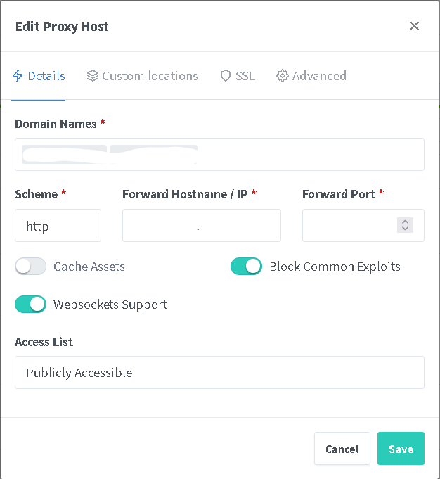
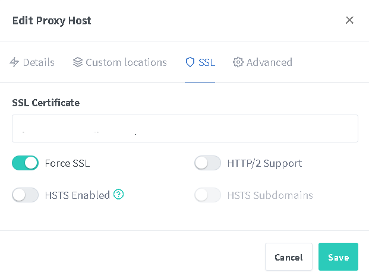

Putting Yacht behind a webproxy is easy, we recommend the following setup.

Using the container or setup from: https://github.com/NginxProxyManager/nginx-proxy-manager

The following configuration: 

- Used to "websocket support was required", this is no longer true. It is recommended but Yacht will work without it. 
- Using a subdomain such as "yacht.domain.com"
- Using https and forcing SSL
- Set the Yacht container to bridged network
- Leave Nginx Proxy Manager on its default proxy network.

Configure Nginx using the subdomain. 
- The IP of the docker host (such as 192.168.0.x or equiv.).
- The docker port you set Yacht to such as 8000.
- Use http between the Nginx host and the Yacht container. 

Additional security:
- Limit your firewall access to allow communication from Yacht to Nginx host on specified port only. 
- Your have to research this and lock down your firewall your self, we can not provide support for this. 

